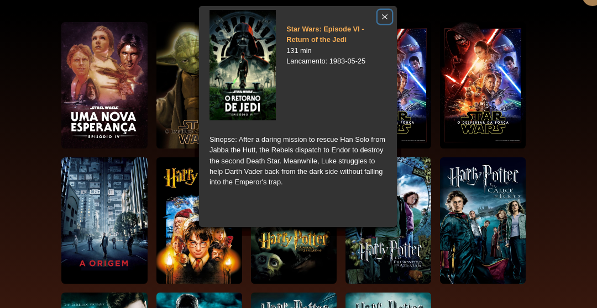
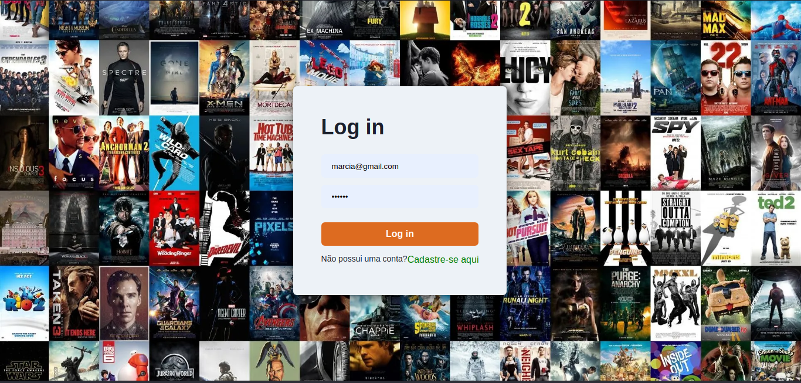
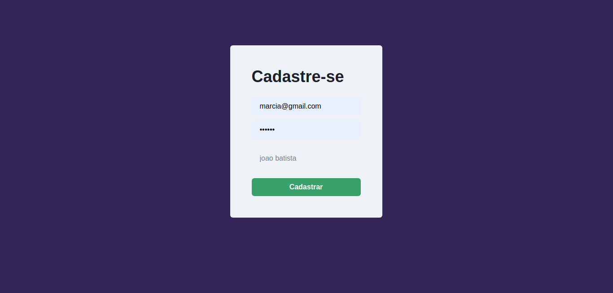
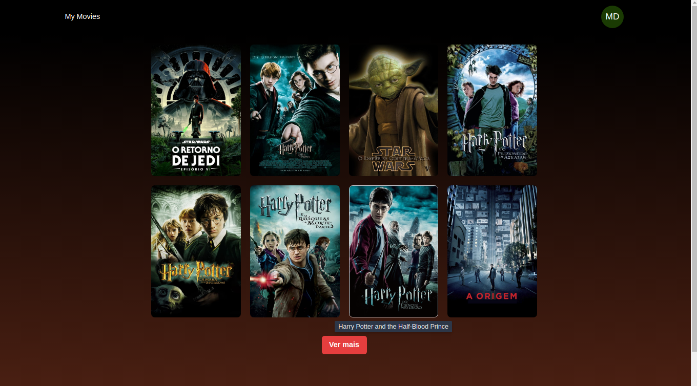
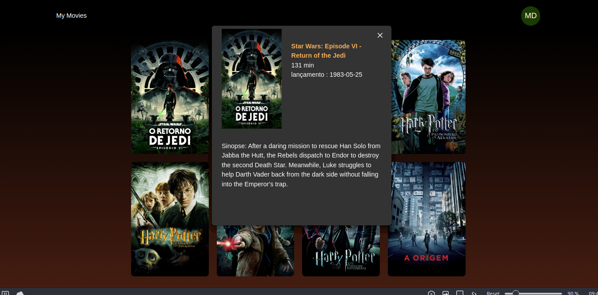
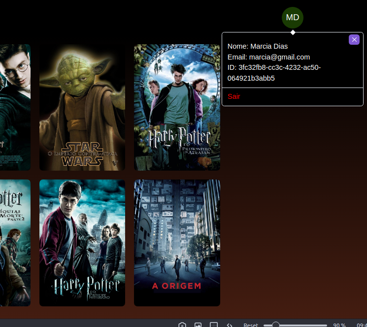

Nome do Projeto
My Movies - Frontend

Descrição
Este é o frontend do projeto My Movies, uma aplicação para gerenciar seus filmes favoritos. O projeto permite que os usuários visualizem uma lista de filmes, vejam detalhes de cada filme .

Funcionalidades
Visualizar lista de filmes
Ver detalhes de um filme

Tecnologias Utilizadas
React.js
Chakra UI (biblioteca de componentes UI)
Axios (para fazer requisições HTTP)
React Router (para navegação entre páginas)

Instalação
Clone o repositório para o seu computador:

bash
Copy code
git clone https://github.com/seu-usuario/my-movies-frontend.git
Navegue até o diretório do projeto:

cd my-movies-frontend
Instale as dependências do projeto:

yarn
Inicie o servidor de desenvolvimento:

yarn dev
Acesse o aplicativo no seu navegador em http://localhost:3000.

Uso
Após iniciar o servidor de desenvolvimento, você verá a lista de filmes na página inicial. Clique em um filme para ver mais detalhes sobre ele. Na página de detalhes do filme, você pode clicar no botão "Adicionar aos Favoritos" para adicionar o filme à sua lista de favoritos.

Licença
Este projeto está sob a licença MIT.

Contato
Se tiver alguma dúvida ou sugestão, entre em contato:

Nome: Jhonathan
